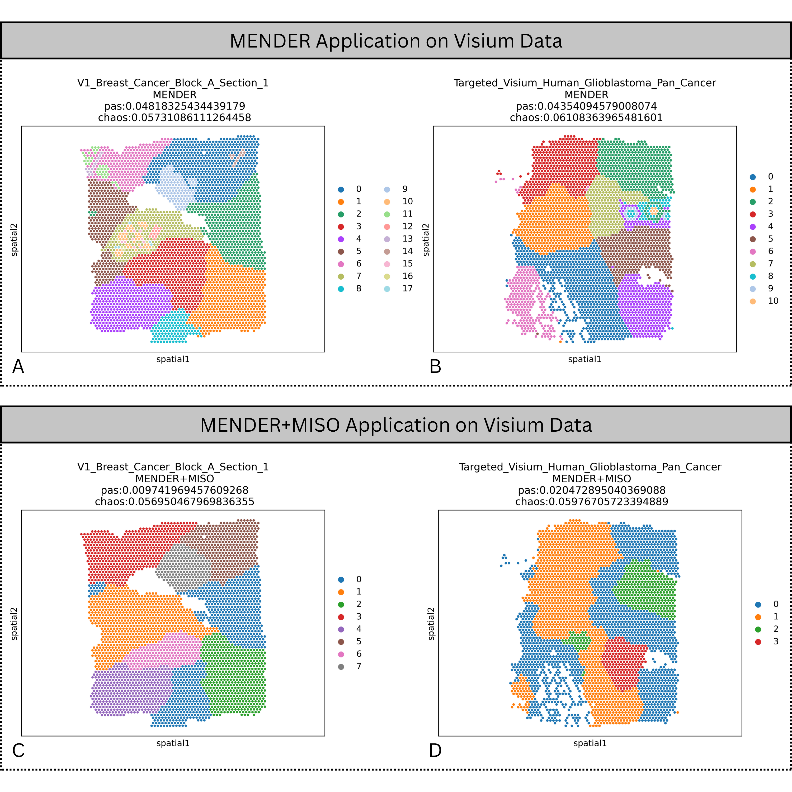

# Applying MENDER and MISO on Multi-modal Spatial Omics Data

Student name: Ho Thi Ngoc Phuong
Student ID: 6172970

## Motivations and Research Questions

When applying MENDER to Visium spatial transcriptomics data available via Squidpy documentation [^squidpy], initial observations reveals substantial variability and apparent noise in certain spatial domain predictions. Specifically, in Subfigure A of Figure 1, domain 7 (highlighted in yellow-green, slightly left of center, above domain 3 in red) includes numerous isolated regions resembling noise rather than biologically meaningful domains. Similarly, Subfigure B shows a complex region containing multiple fragmented domains (specifically domains 2, 4, 8, 9, and 10), suggesting potential inconsistencies originating from noisy gene expression data.

<figure>
    
    <figcaption>Figure 1: <b>Comparison of Spatial Domain Predictions by MENDER and MENDER+MISO on Visium Data.</b> (<b>A-B</b>) Spatial domain predictions produced by MENDER, using embeddings generated solely by PCA of gene expression data. Note the presence of fragmented and potentially noisy domains (e.g., domain 7 in subfigure A and the region containing domains 2, 4, 8, 9, and 10 in subfigure B). (<b>C-D</b>) Spatial domain predictions using the integrated MENDER+MISO framework, incorporating learned cell representations from both gene expression matrices and H&E histological images. Predictions appear more coherent with fewer fragmented domains, indicating improved robustness and stability.</figcaption>
</figure>

[^squidpy]: https://squidpy.readthedocs.io/en/stable/api/squidpy.datasets.imc.html

Additionally, the original MENDER pipeline described by Yuan et al. [^yuan2024mender] employs a straightforward cell typing approach, relying solely on principal component analysis (PCA) of filtered gene expression matrices followed by Leiden clustering. Although PCA effectively reduces dimensionality, it might not capture more nuanced cellular features critical for precise cell type identification. Given that accurate cell typing directly affects the extraction of multi-range neighborhood representations downstream, investigating more robust and informative methods for cell embedding generation could significantly enhance pipeline performance.

[^yuan2024mender]: Yuan, Zhiyuan. "MENDER: fast and scalable tissue structure identification in spatial omics data." Nature Communications 15.1 (2024): 207.

One promising solution for mitigating prediction noise and improving cell type identification involves integrating deeply learned cell representations. The MISO framework [^coleman2025resolving] offers precisely such an approach, enabling joint representation learning from gene expression data combined with additional modalities, potentially stabilizing domain predictions and refining cell classifications.

[^coleman2025resolving]: Coleman, Kyle, et al. "Resolving tissue complexity by multimodal spatial omics modeling with MISO." Nature methods (2025): 1-9.

Consequently, this study addresses the following research questions:

-   Can integrating additional data modalities (e.g., imaging data) stabilize and enhance spatial domain predictions generated by MENDER?
-   Is Principal Component Analysis (PCA) sufficient for effective cell typing, or do learned cell representations provide superior accuracy and robustness?

## Installation

Clone this repository and enter the project folder:

```bash
git clone https://github.com/ianjoshi/mender-reproduction.git
cd mender-reproduction/phuong_ho
```

Create and activate the Conda environment, then install dependencies:

```bash
conda create -n momender python=3.12
conda activate momender
pip install -r requirements.txt
```

## Usage

### Running on MERFISH Aging Data

Open and execute [MERFISH Aging Data](run_allen_aging.ipynb) in Jupyter Notebook or JupyterLab.

### Running on Human Heart Atlas Data

Open and execute [Human Heart Atlas Data](run_human_heart.ipynb)

### Result Analysis and Hypothesis Testing

Review findings and visualizations in [Result Analysis](result_analysis.ipynb)

## Acknowledgements

This project integrates several external libraries by cloning their repos as local modules due to version conflicts:

-   [miso](https://github.com/kpcoleman/miso/tree/main)
-   [MENDER](https://github.com/yuanzhiyuan/MENDER/tree/master)
-   [pysodb](https://github.com/TencentAILabHealthcare/pysodb)

OME-TIFF -> TIFF conversion uses [bftools](https://docs.openmicroscopy.org/bio-formats/5.7.3/users/comlinetools/index.html) (requires [Java](https://www.java.com/en/download/)).
